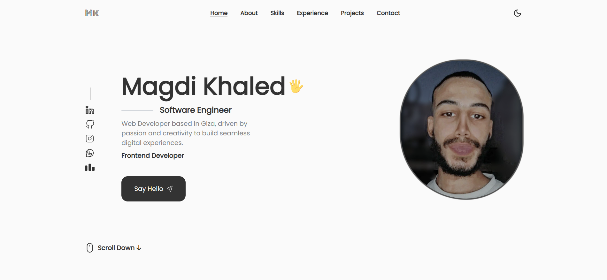

# My Personal Portfolio

A fully responsive portfolio website built with Vue.js, showcasing my projects, skills, and contact information with a clean and interactive design.

🔗 https://magdi-khaled-portfolio.vercel.app

 

Welcome to my portfolio repository! 🚀 This space highlights my expertise, projects, and journey as a **Frontend Developer | Software Engineer**, blending creativity with technical precision to build impactful web solutions.

## Features

- Responsive Design — Seamlessly adapts across all devices.
- Interactive UI — Engaging and dynamic interface with smooth animations.
- Dark Mode — Toggle between light and dark themes.
- Project Showcase — Display of projects with live demos and source code links.
- Contact Form — Visitors can send direct messages through the website.

## Technologies Used

- Vue.js — Framework for building user interfaces.
- Pinia — Lightweight state management for Vue.
- Tailwind CSS — Utility CSS framework for styling.
- HTML5 — Markup language for structuring the web content.
- CSS3 — Styling and layout.
- JavaScript (ES6+) — Adding interactivity.

## Get In Touch

- Feel free to reach out if you'd like to collaborate!
- Email: magdikhaled23s@gmail.com
- LinkedIn: [Magdi Khaled | Linked In](https://www.linkedin.com/in/magdi-khaled-2b1b61206/)

## 📄 License

This project is licensed under the [MIT License](./LICENSE) – © 2025 Magdi Khaled Kelany
